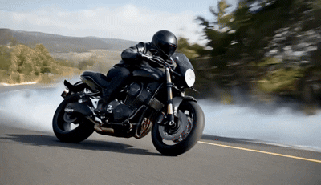
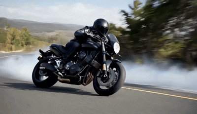
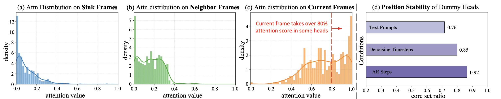
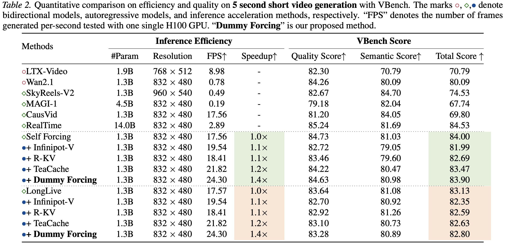

<div align="center">
⚡️**Video Generation at 24FPS** ⚡️


<h2>
Efficient Autoregressive Video Diffusion with Dummy Head
</h2>

[Hang Guo](https://csguoh.github.io/), [Zhaoyang Jia](https://scholar.google.com/citations?user=ObkbCWkAAAAJ&hl=zh-CN), [Jiahao Li](https://scholar.google.com/citations?user=AcOcw0AAAAAJ&hl=zh-CN), [Bin Li](https://www.microsoft.com/en-us/research/people/libin/), [Yuanhao Cai](https://caiyuanhao1998.github.io/), [Jiangshan Wang](https://scholar.google.com/citations?user=HoKoCv0AAAAJ&hl=en), [Yawei Li](https://yaweili.bitbucket.io/), [Yan Lu](https://www.microsoft.com/en-us/research/people/yanlu/)


[]()
[](https://csguoh.github.io/project/DummyForcing/)

</div>

---
Dummy Forcing is built on the observation that about **25%** attention heads in existing autoregressive video diffusion models are "dummy", attending almost exclusively to the current frame despite access to historical context. Based on this observation, Dummy Forcing develops a technique to automatically identifies dummy heads and allocates varying context. Leveraging this "dummy property", we can enable 1. Efficient Video Generation at **24.3FPS** real-time speed. 2. High-resolution Video Generation which supports 720P&1080P with **2.0x speedup**. 3. Long-context Video Gneration to enlarge the context window by **6.58x** without lossing efficiency.

---


⭐If this work is helpful for you, please help star this repo. Thanks!🤗


## <a name="results"></a> 🥇 Results
Our Dummy Forcing can generate videos at **24.3FPS** speed, click to see the generation results below!

### 5-second Short Video

<details>
<summary><b>click to expand</b></summary>
<table>
<tr>
<td align="center" style="border: 2px solid #000; padding: 10px;">
<div style="font-size: 1.1em;">Self Forcing (baseline) 17.5FPS</div>
<div></div>
</td>
<td align="center" style="border: 2px solid #000; padding: 10px;">
<div style="font-size: 1.1em;">Dummy Forcing (ours) <b>24.3FPS</b></div>
<div></div>
</td>
</tr>
<tr>
<td align="center" style="border: 2px solid #000; padding: 10px;">
<div style="font-size: 1.1em;">Self Forcing (baseline) 17.5FPS</div>
<div></div>
</td>
<td align="center" style="border: 2px solid #000; padding: 10px;">
<div style="font-size: 1.1em;">Dummy Forcing (ours) <b>24.3FPS</b></div>
<div></div>
</td>
</tr>
<tr>
<td align="center" style="border: 2px solid #000; padding: 10px;">
<div style="font-size: 1.1em;">Self Forcing (baseline) 17.5FPS</div>
<div></div>
</td>
<td align="center" style="border: 2px solid #000; padding: 10px;">
<div style="font-size: 1.1em;">Dummy Forcing (ours) <b>24.3FPS</b></div>
<div></div>
</td>
</tr>
<tr>
<td align="center" style="border: 2px solid #000; padding: 10px;">
<div style="font-size: 1.1em;">Self Forcing (baseline) 17.5FPS</div>
<div></div>
</td>
<td align="center" style="border: 2px solid #000; padding: 10px;">
<div style="font-size: 1.1em;">Dummy Forcing (ours) <b>24.3FPS</b></div>
<div></div>
</td>
</tr>
<tr>
<td align="center" style="border: 2px solid #000; padding: 10px;">
<div style="font-size: 1.1em;">Self Forcing (baseline) 17.5FPS</div>
<div></div>
</td>
<td align="center" style="border: 2px solid #000; padding: 10px;">
<div style="font-size: 1.1em;">Dummy Forcing (ours) <b>24.3FPS</b></div>
<div></div>
</td>
</tr>
<tr>
<td align="center" style="border: 2px solid #000; padding: 10px;">
<div style="font-size: 1.1em;">Self Forcing (baseline) 17.5FPS</div>
<div></div>
</td>
<td align="center" style="border: 2px solid #000; padding: 10px;">
<div style="font-size: 1.1em;">Dummy Forcing (ours) <b>24.3FPS</b></div>
<div></div>
</td>
</tr>
<tr>
<td align="center" style="border: 2px solid #000; padding: 10px;">
<div style="font-size: 1.1em;">Self Forcing (baseline) 17.5FPS</div>
<div></div>
</td>
<td align="center" style="border: 2px solid #000; padding: 10px;">
<div style="font-size: 1.1em;">Dummy Forcing (ours) <b>24.3FPS</b></div>
<div></div>
</td>
</tr>
</table>
</details>

### 30-second Long Video


<details>
<summary><b>click to expand</b></summary>
<table>
<tr>
<td align="center" style="border: 2px solid #000; padding: 10px;">
<div style="font-size: 1.1em;">Self Forcing (baseline) 17.5FPS</div>
<div></div>
</td>
<td align="center" style="border: 2px solid #000; padding: 10px;">
<div style="font-size: 1.1em;">Dummy Forcing (ours) <b>24.3FPS</b></div>
<div></div>
</td>
</tr>
<tr>
<td align="center" style="border: 2px solid #000; padding: 10px;">
<div style="font-size: 1.1em;">Self Forcing (baseline) 17.5FPS</div>
<div></div>
</td>
<td align="center" style="border: 2px solid #000; padding: 10px;">
<div style="font-size: 1.1em;">Dummy Forcing (ours) <b>24.3FPS</b></div>
<div></div>
</td>
</tr>
<tr>
<td align="center" style="border: 2px solid #000; padding: 10px;">
<div style="font-size: 1.1em;">Self Forcing (baseline) 17.5FPS</div>
<div></div>
</td>
<td align="center" style="border: 2px solid #000; padding: 10px;">
<div style="font-size: 1.1em;">Dummy Forcing (ours) <b>24.3FPS</b></div>
<div></div>
</td>
</tr>
<tr>
<td align="center" style="border: 2px solid #000; padding: 10px;">
<div style="font-size: 1.1em;">Self Forcing (baseline) 17.5FPS</div>
<div></div>
</td>
<td align="center" style="border: 2px solid #000; padding: 10px;">
<div style="font-size: 1.1em;">Dummy Forcing (ours) <b>24.3FPS</b></div>
<div></div>
</td>
</tr>
</table>
</details>

## ✨ Highlights


1️⃣ **Over 50% Heads in existing autoregressive video diffusion models are ''Dummy''** 

<p align="center">
    
</p>
2️⃣ **Training-Free Efficient Video Generation (480P/720P/1080P, up to 2.0x speedup)**

<p align="center">
    
</p>


3️⃣ **Enlarge Context Window w/o increasing overhead (6.58x longer context)** 

<p align="center">
    
</p>


## 📑 Contents

- [News](#news)
- [Pipeline](#pipeline)
- [TODO](#todo)
- [Results](#results)
- [Citation](#cite)

## <a name="news"></a> 🆕 News

- **2026-01-xx:** arXiv paper available.
- **2026-01-xx:** We have open sourced all our code.

## <a name="todo"></a> ☑️ TODO

- [x] arXiv version available 
- [x] Release all code
- [x] Support [TeaCache](https://github.com/ali-vilab/TeaCache) for more aggressive sppedup -> over **30FPS!**
- [ ] Further improvement


## 💪Get Started

**NOTE!** We have unified the [Self-Forcing](https://github.com/guandeh17/Self-Forcing) and [LongLive](https://github.com/NVlabs/LongLive) video generation pipelines into this single repository, so you can flexibly switch between models by changing the configuration file :D

### Installation
> NOTE: At least 40GB GPU memory is needed.

Creat a conda environment and install dependencies: (we have tested our code under cuda13.0 on a H100, and one may modify the torch version for adaptation)
```
git clone https://github.com/cshguo/DummyForcing
cd ./DummyForcing
conda create -n dummyforcing python=3.10 -y
conda activate dummyforcing
pip install torch==2.9.0 torchvision==0.24.0 torchaudio==2.9.0 --index-url https://download.pytorch.org/whl/cu130
pip install -r requirements.txt
pip install flash-attn --no-build-isolation
```

Download the pre-trained ckpt (each model will be saved in a separate folder under `/path/to/pretrained`):
```
cd /path/to/pretrained
bash /path/to/DummyForcing/hfd.sh Wan-AI/Wan2.1-T2V-1.3B
bash /path/to/DummyForcing/hfd.sh Efficient-Large-Model/LongLive-1.3B
bash /path/to/DummyForcing/hfd.sh gdhe17/Self-Forcing
```
After downloading the above ckpt, one may need to modify the ckpt path specifized in the `config/longlive_inference.yaml` and `utils/wan_wrapper.py`.

### 5s Short Video Generation
Example inference command with **Self-Forcing** model:

```
python inference.py --config_path configs/self_forcing_inference.yaml
```

Example inference command with **LongLive** model:

```
python inference.py --config_path configs/longlive_inference.yaml
```
> You can also modify the text prompts in the `./prompts/example_prompts.txt` for customization.

The generated videos should be stored in the `./videos` file folder.

Gneration speed on our single H100 GPU:

```
Profiling results:
  - Initialization/caching time: 2.47 ms (0.03%)
  - Diffusion generation time: 3409.26 ms (43.05%)
    - Block 0 generation time: 404.37 ms (11.86% of diffusion)
    - Block 1 generation time: 487.63 ms (14.30% of diffusion)
    - Block 2 generation time: 543.08 ms (15.93% of diffusion)
    - Block 3 generation time: 492.40 ms (14.44% of diffusion)
    - Block 4 generation time: 493.01 ms (14.46% of diffusion)
    - Block 5 generation time: 494.33 ms (14.50% of diffusion)
    - Block 6 generation time: 494.13 ms (14.49% of diffusion)
  - VAE decoding time: 4507.72 ms (56.92%)
  - Total time: 7919.44 ms
```

Each AR step generates 12 frames, so the generation speed is **24.3 frames/second**. Including the VAE time, **Dummy Forcing generates a 5s-long video in 8s.**


For quantitative evaluation on VBench, one can run the following command:


```
# for self-forcing model
torchrun  --nproc_per_node=1 --master_port=39500  sample_vbench.py --config_path configs/self_forcing_vbench.yaml

# for longlive model
torchrun  --nproc_per_node=1 --master_port=29500  sample_vbench.py --config_path configs/longlive_vbench.yaml
```

The above command will generate 5 videos per prompt, and all videos are saved in one folder for subsequent VBench eval. From my experience, the total time for VBench generation usually finish overnight!

After obtaining the generated videos, please see the official repo of [VBench](https://github.com/Vchitect/VBench) for evaluation details.


### Compatibility with TeaCache 

We also support the widely used [teacache](https://github.com/ali-vilab/TeaCache) technique for further more aggressive sppedup (over 30FPS generation speed).

To enable teacache, change the `teacache_enabled` to `true` and the teacache will be automatically used in model forward. Generation speed with teacache at our end:

```
Profiling results:
  - Initialization/caching time: 2.78 ms (0.04%)
  - Diffusion generation time: 2749.15 ms (38.58%)
    - Block 0 generation time: 326.90 ms (11.89% of diffusion)
    - Block 1 generation time: 389.67 ms (14.17% of diffusion)
    - Block 2 generation time: 458.02 ms (16.66% of diffusion)
    - Block 3 generation time: 394.99 ms (14.37% of diffusion)
    - Block 4 generation time: 392.39 ms (14.27% of diffusion)
    - Block 5 generation time: 393.77 ms (14.32% of diffusion)
    - Block 6 generation time: 393.06 ms (14.30% of diffusion)
  - VAE decoding time: 4373.46 ms (61.38%)
  - Total time: 7125.39 ms
```


### 30s Long Video Generation
To generate a 30s long video, one can modify the `num_output_frames` params in the `./configs/longlive_inference.yaml` to `120` which will generate ~480 frames.

After this modification, run the command below:

```
python inference.py --config_path configs/longlive_inference.yaml
```

Note that Self-forcing is not specially trained for long video, so the performance may not as good as LongLive. However, one can also do the same thing above to test on Self Forcing model.

### 60s Interactive Video Generation

```
python interactive_inference.py --config_file configs/longlive_interactive_inference.yaml
```

The results will be saved in `./interactive_videos`. 

You can also modify the interactive prompts in `prompts/interactive_example.jsonl` to generate other story telling videos.


### High-resolution Video Generation

The high-resolution video generation, e.g., 720P and 1080P, can be simply achieved by changing the shape of initial Gaussian noise.

In detail, change the `resolution` parameter in the `longlive_inference.yaml` or `self_forcing_inference.yaml` to 720 or 1080 to allow high-resolution video generation!

For example, for 720P video generation, after changing the `resolution`, one can run:

```
python inference.py --config_path configs/self_forcing_inference.yaml
python inference.py --config_path configs/longlive_inference.yaml
```


## <a name="cite"></a> 🥰 Citation

Please cite us if our work is useful for your research.

```

```

## License

Our code are under Apache-2.0 license. Users should also follow the license of the corresponding backbone models we use like [Self-Forcing (Apache-2.0 license)](https://github.com/guandeh17/Self-Forcing) and [LongLive (Apache-2.0 license)](https://github.com/NVlabs/LongLive). 


## Contact

If you have any questions during your reproduce, feel free to approach me at cshguo@gmail.com